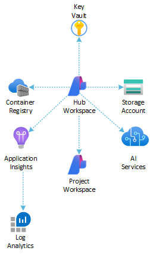

# Deploy Secure Azure AI Studio via Bicep

This collection of `Bicep` templates demonstrates how to set up an [Azure AI Studio](https://learn.microsoft.com/en-us/azure/ai-studio/what-is-ai-studio) environment with managed identity and Azure RBAC to connected [Azure AI Services](https://learn.microsoft.com/en-us/azure/ai-services/what-are-ai-services) and dependent resources.

[](https://portal.azure.com/#create/Microsoft.Template/uri/https%3A%2F%2Fraw.githubusercontent.com%2FAzure-Samples%2Fazure-ai-studio-secure-bicep%2Fmain%2Fbicep%2Fmain.bicep)
[](http://armviz.io/#/?load=https%3A%2F%2Fraw.githubusercontent.com%2FAzure-Samples%2Fazure-ai-studio-secure-bicep%2Fmain%2Fbicep%2Fmain.bicep)

## Azure Resources

The Bicep modules deploy the following Azure resources:



| Resource                    | Type                                                                                                                                                                    | Description                                                                                                                 |
| --------------------------- | ----------------------------------------------------------------------------------------------------------------------------------------------------------------------- | --------------------------------------------------------------------------------------------------------------------------- |
| Azure Application Insights  | [Microsoft.Insights/components](https://learn.microsoft.com/en-us/azure/templates/microsoft.insights/components?pivots=deployment-language-bicep)                       | An Azure Application Insights instance associated with the Azure AI Studio workspace                                        |
| Azure Monitor Log Analytics | [Microsoft.OperationalInsights/workspaces](https://learn.microsoft.com/en-us/azure/templates/microsoft.operationalinsights/workspaces?pivots=deployment-language-bicep) | An Azure Log Analytics workspace used to collect diagnostics logs and metrics from Azure resources                          |
| Azure Key Vault             | [Microsoft.KeyVault/vaults](https://learn.microsoft.com/en-us/azure/templates/microsoft.keyvault/vaults?pivots=deployment-language-bicep)                               | An Azure Key Vault instance associated with the Azure AI Studio workspace                                                   |
| Azure Storage Account       | [Microsoft.Storage/storageAccounts](https://learn.microsoft.com/en-us/azure/templates/microsoft.storage/storageaccounts)                                                | An Azure Storage instance associated with the Azure AI Studio workspace                                                     |
| Azure Container Registry    | [Microsoft.ContainerRegistry/registries](https://learn.microsoft.com/en-us/azure/templates/microsoft.containerregistry/registries)                                      | An Azure Container Registry instance associated with the Azure AI Studio workspace                                          |
| Azure AI Hub / Project      | [Microsoft.MachineLearningServices/workspaces](https://learn.microsoft.com/en-us/azure/templates/microsoft.machinelearningservices/workspaces)                          | An Azure AI Studio Hub and Project (Azure ML Workspace of kind 'hub' and 'project')                                         |
| Azure AI Services           | [Microsoft.CognitiveServices/accounts](https://learn.microsoft.com/en-us/azure/templates/microsoft.cognitiveservices/accounts)                                          | An Azure AI Services as the model-as-a-service endpoint provider including GPT-4o and ADA Text Embeddings model deployments |

> [!NOTE]
> You can select a different version of the GPT model by specifying the `openAiDeployments` parameter in the [`main.bicepparam` parameters file](./bicep/main.bicepparam). For details on the models available in various Azure regions, please refer to the [Azure OpenAI Service models](https://learn.microsoft.com/en-us/azure/ai-services/openai/concepts/models) documentation.

> [!NOTE]
> The default deployment includes an Azure Container Registry resource. However, if you wish not to deploy an Azure Container Registry, you can simply set the `acrEnabled` parameter to `false`.

## Bicep Parameters

Specify a value for the **required** parameters in the [`main.bicepparam` parameters file](./bicep/main.bicepparam) before deploying the Bicep modules.

| Name                                      | Required | Type   | <div style="width:150px">Allowed Values</div>     | Description |
| ----------------------------------------- | -------- | ------ | ---------------------------------------------------------- | ----------- |
| prefix                                    | Required | string | N/A                                                        | Specifies the name prefix for all the Azure resources.                                                                                                  |
| suffix                                    | Required | string | N/A                                                        | Specifies the name suffix for all the Azure resources.                                                                                                  |
| location                                  | Required | string | N/A                                                        | Specifies the location for all the Azure resources.                                                                                                     |
| userObjectId                              | Required | string | N/A                                                        | Specifies the object id of a Microsoft Entra ID user to assign necessary RBAC to.                                                                       |
| hubName                                   | Optional | string | N/A                                                        | Specifies the name Azure AI Hub workspace.                                                                                                              |
| hubFriendlyName                           | Optional | string | N/A                                                        | Specifies the friendly name of the Azure AI Hub workspace.                                                                                              |
| hubDescription                            | Optional | string | N/A                                                        | Specifies the description for the Azure AI Hub workspace displayed in Azure AI Studio.                                                                  |
| hubIsolationMode                          | Optional | string | AllowInternetOutbound, AllowOnlyApprovedOutbound, Disabled | Specifies the isolation mode for the managed network of the Azure AI Hub workspace.                                                                     |
| hubPublicNetworkAccess                    | Optional | string | N/A                                                        | Specifies the public network access for the Azure AI Hub workspace.                                                                                     |
| connectionAuthType                        | Optional | string | ApiKey, AAD, ManagedIdentity, None                         | Specifies the authentication method for the OpenAI Service connection.                                                                                  |
| customConnectionName                      | Optional | string | N/A                                                        | Specifies the name for the custom connection.                                                                                                           |
| projectName                               | Optional | string | N/A                                                        | Specifies the name Azure AI Project workspace.                                                                                                          |
| projectFriendlyName                       | Optional | string | N/A                                                        | Specifies the friendly name of the Azure AI Project workspace.                                                                                          |
| projectPublicNetworkAccess                | Optional | string | N/A                                                        | Specifies the public network access for the Azure AI Project workspace.                                                                                 |
| logAnalyticsName                          | Optional | string | N/A                                                        | Specifies the name of the Azure Log Analytics resource.                                                                                                 |
| logAnalyticsSku                           | Optional | string | Free, Standalone, PerNode, PerGB2018                       | Specifies the service tier of the workspace.                                                                                                            |
| logAnalyticsRetentionInDays               | Optional | int    | N/A                                                        | Specifies the workspace data retention in days. -1 means Unlimited retention for the Unlimited Sku. 730 days is the maximum allowed for all other Skus. |
| applicationInsightsName                   | Optional | string | N/A                                                        | Specifies the name of the Azure Application Insights resource.                                                                                          |
| aiServicesName                            | Optional | string | N/A                                                        | Specifies the name of the Azure AI Services resource.                                                                                                   |
| aiServicesSku                             | Optional | object | N/A                                                        | Specifies the resource model definition representing SKU.                                                                                               |
| aiServicesIdentity                        | Optional | object | N/A                                                        | Specifies the identity of the Azure AI Services resource.                                                                                               |
| aiServicesCustomSubDomainName             | Optional | string | N/A                                                        | Specifies an optional subdomain name used for token-based authentication.                                                                               |
| aiServicesDisableLocalAuth                | Optional | bool   | N/A                                                        | Specifies whether to disable local authentication via API key.                                                                                          |
| aiServicesPublicNetworkAccess             | Optional | string | Enabled, Disabled                                          | Specifies whether public endpoint access is allowed for this account.                                                                                   |
| openAiDeployments                         | Optional | array  | N/A                                                        | Specifies the OpenAI deployments to create.                                                                                                             |
| keyVaultName                              | Optional | string | N/A                                                        | Specifies the name of the Azure Key Vault resource.                                                                                                     |
| keyVaultNetworkAclsDefaultAction          | Optional | string | Allow, Deny                                                | Specifies the default action of allow or deny when no other rules match for the Azure Key Vault resource.                                               |
| keyVaultEnabledForDeployment              | Optional | bool   | N/A                                                        | Specifies whether the Azure Key Vault resource is enabled for deployments.                                                                              |
| keyVaultEnabledForDiskEncryption          | Optional | bool   | N/A                                                        | Specifies whether the Azure Key Vault resource is enabled for disk encryption.                                                                          |
| keyVaultEnabledForTemplateDeployment      | Optional | bool   | N/A                                                        | Specifies whether the Azure Key Vault resource is enabled for template deployment.                                                                      |
| keyVaultEnableSoftDelete                  | Optional | bool   | N/A                                                        | Specifies whether soft delete is enabled for the Azure Key Vault resource.                                                                              |
| keyVaultEnablePurgeProtection             | Optional | bool   | N/A                                                        | Specifies whether purge protection is enabled for the Azure Key Vault resource.                                                                         |
| keyVaultEnableRbacAuthorization           | Optional | bool   | N/A                                                        | Specifies whether to enable RBAC authorization for the Azure Key Vault resource.                                                                        |
| keyVaultSoftDeleteRetentionInDays         | Optional | int    | N/A                                                        | Specifies the soft delete retention in days.                                                                                                            |
| acrName                                   | Optional | string | N/A                                                        | Specifies the name of the Azure Container Registry resource.                                                                                            |
| acrAdminUserEnabled                       | Optional | bool   | N/A                                                        | Enable admin user that have push/pull permission to the registry.                                                                                       |
| acrSku                                    | Optional | string | Basic, Standard, Premium                                   | Tier of your Azure Container Registry.                                                                                                                  |
| storageAccountName                        | Optional | string | N/A                                                        | Specifies the name of the Azure Storage Account resource.                                                                                               |
| storageAccountAccessTier                  | Optional | string | N/A                                                        | Specifies the access tier of the Azure Storage Account resource (default: Hot).                                                                         |
| storageAccountAllowBlobPublicAccess       | Optional | bool   | N/A                                                        | Specifies whether the Azure Storage Account resource allows public access to blobs (default: false).                                                    |
| storageAccountAllowSharedKeyAccess        | Optional | bool   | N/A                                                        | Specifies whether the Azure Storage Account resource allows shared key access (default: true).                                                          |
| storageAccountAllowCrossTenantReplication | Optional | bool   | N/A                                                        | Specifies whether the Azure Storage Account resource allows cross-tenant replication (default: false).                                                  |
| storageAccountMinimumTlsVersion           | Optional | string | N/A                                                        | Specifies the minimum TLS version to be permitted on requests to the Azure Storage Account resource (default: TLS1_2).                                  |
| storageAccountANetworkAclsDefaultAction   | Optional | string | Allow, Deny                                                | Default action of allow or deny when no other rules match.                                                                                              |
| storageAccountSupportsHttpsTrafficOnly    | Optional | bool   | N/A                                                        | Specifies whether the Azure Storage Account resource should only support HTTPS traffic.                                                                 |
| tags                                      | Optional | object | N/A                                                        | Specifies the resource tags for all the resources.                                                                                                      |

We suggest reading sensitive configuration data such as passwords or SSH keys from a pre-existing Azure Key Vault resource. For more information, see [Create parameters files for Bicep deployment](https://learn.microsoft.com/en-us/azure/azure-resource-manager/bicep/parameter-files?tabs=Bicep)

## Getting Started

To deploy the infrastructure for the secure Azure AI Studio, you need to:

### Prerequisites

Before you begin, ensure you have the following:

- An active [Azure subscription](https://azure.microsoft.com/en-us/free/)
- Azure CLI installed on your local machine. Follow the [installation guide](https://docs.microsoft.com/en-us/cli/azure/install-azure-cli) if needed.
- Appropriate permissions to create resources in your Azure account
- Basic knowledge of using the command line interface

### Step 1: Clone the Repository

Start by cloning the repository to your local machine:

```bash
git clone <repository_url>
cd bicep
```

### Step 2: Configure Parameters

Edit the [`main.bicepparam` file](./bicep/main.bicepparam) to configure values for the parameters required by the `Bicep` templates. **Make sure** you set appropriate values for resource group name, location, and other necessary parameters in the [`deploy.sh` Bash script](./bicep/deploy.sh).

### Step 3: Deploy Resources

Use the [`deploy.sh` script](./bicep/deploy.sh) to deploy the Azure resources via Bicep. This script will provision all the necessary resources as defined in the Bicep templates.

Run the following command to deploy the resources:

```bash
./deploy.sh --resourceGroupName <resource-group-name> --location <location>
```

### How to Test

By following these steps, you will have Azure AI Studio set up and ready for your projects using Bicep. If you encounter any issues, refer to the additional resources or seek help from the Azure support team.

After deploying the resources, you can verify the deployment by checking the [Azure Portal](https://portal.azure.com) or [Azure AI Studio](https://ai.azure.com/build). Ensure all the resources are created and configured correctly.

You can also follow these [instructions](./promptflow/README.md) to deploy, expose, and call the [Basic Chat](https://github.com/microsoft/promptflow/tree/main/examples/flows/chat/chat-basic) prompt flow using Bash scripts and Azure CLI.


## Learn More

For more information, see:

- [Azure AI Studio Documentation](https://aka.ms/aistudio/docs)
