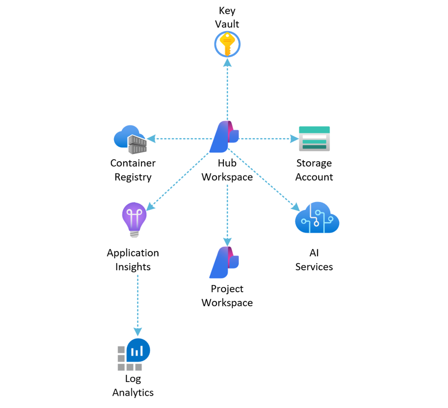
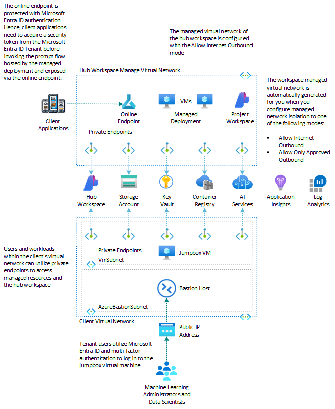
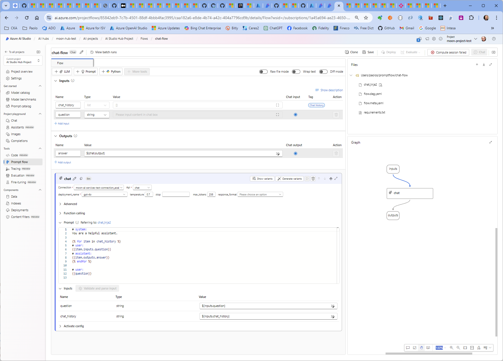

# Deploy Secure Azure AI Studio via Bicep

This collection of `Bicep` templates demonstrates how to set up an [Azure AI Studio](https://learn.microsoft.com/en-us/azure/ai-studio/what-is-ai-studio) environment with or without a managed network and with managed identity and Azure RBAC to connected [Azure AI Services](https://learn.microsoft.com/en-us/azure/ai-services/what-are-ai-services) and dependent resources.

## Deploy Secure Azure AI Studio without a managed virtual network

The collection of [Bicep](https://learn.microsoft.com/en-us/azure/azure-resource-manager/bicep/file) templates located in the [bicep/novnet](./bicep/novnet/README.md) folder demonstrates how to configure an [Azure AI Studio](https://learn.microsoft.com/en-us/azure/ai-studio/what-is-ai-studio) environment with managed identity and Azure RBAC for connecting to [Azure AI Services](https://learn.microsoft.com/en-us/azure/ai-services/what-are-ai-services) and dependent resources. For more details and deployment instructions, see [Deploy Secure Azure AI Studio without a managed virtual network](./bicep/novnet/README.md).

## Deploy Secure Azure AI Studio with a managed virtual network

The collection of [Bicep](https://learn.microsoft.com/en-us/azure/azure-resource-manager/bicep/file) templates under the [bicep/managedvnet](./bicep/managedvnet/README.md) folder demonstrates how to set up an [Azure AI Studio](https://learn.microsoft.com/en-us/azure/ai-studio/what-is-ai-studio) environment with managed identity and Azure RBAC to connected [Azure AI Services](https://learn.microsoft.com/en-us/azure/ai-services/what-are-ai-services) and dependent resources, with the managed virtual network isolation mode set to [Allow Internet Outbound](https://learn.microsoft.com/en-us/azure/ai-studio/how-to/configure-managed-network). For more details and deployment instructions, see [Deploy Secure Azure AI Studio with a managed virtual network](./bicep/managedvnet/README.md).

> For more information on the network topology, see [How to configure a managed network for Azure AI Studio hubs](https://learn.microsoft.com/en-us/azure/ai-studio/how-to/configure-managed-network).

### How to Test

By following these steps, you will have Azure AI Studio set up and ready for your projects using Bicep. If you encounter any issues, refer to the additional resources or seek help from the Azure support team.

After deploying the resources, you can verify the deployment by checking the [Azure Portal](https://portal.azure.com) or [Azure AI Studio](https://ai.azure.com/build). Ensure all the resources are created and configured correctly.

You can also follow these [instructions](./promptflow/README.md) to deploy, expose, and call the [Basic Chat](https://github.com/microsoft/promptflow/tree/main/examples/flows/chat/chat-basic) prompt flow using Bash scripts and Azure CLI.

## Learn More

For more information, see:

- [Azure AI Studio Documentation](https://aka.ms/aistudio/docs)
